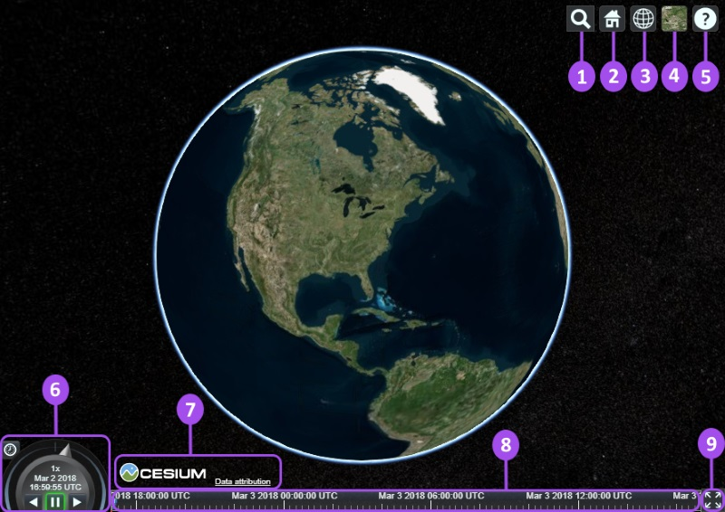

# cesium 基础

::: tip 前言

- Cesium 是一个跨平台、跨浏览器的展示三维地球和地图的 javascript 库。
- Cesium 使用 WebGL 来进行硬件加速图形，使用时不需要任何插件支持，但是浏览器必须支持 WebGL。
- Cesium 是基于 Apache2.0 许可的开源程序。它可以免费的用于商业和非商业用途。

:::

通过 Cesium 提供的 JS API，可以实现以下功能：

- 支持 2D,2.5D,3D 形式的地理（地图）数据展示
- 可以绘制各种几何图形、高亮区域，支持导入图片，甚至三维模型等多种数据可视化展示
- 可用于动态数据可视化并提供良好的触摸支持，支持绝大多数的浏览器和移动端浏览器
- 支持基于时间轴的动态流式数据展示

:::demo

```vue
<template>
  <div class="map" ref="cesiumContainer"></div>
</template>

<script>
export default {
  name: "CesiumScene",
  mounted() {
    this.init()
  },
  methods: {
    init() {
      new Cesium.Viewer(this.$refs.cesiumContainer)
    },
  },
}
</script>
```

:::



- Geocoder : 一种地理位置搜索工具，用于显示相机访问的地理位置。默认使用微软的 Bing 地图。
- HomeButton : 首页位置，点击之后将视图跳转到默认视角。
- SceneModePicker : 切换 2D、3D 和 Columbus View (CV) 模式。
- BaseLayerPicker : 选择三维数字地球的底图（imagery and terrain）。
- NavigationHelpButton : 帮助提示，如何操作数字地球。
- Animation :控制视窗动画的播放速度。
- CreditsDisplay : 展示商标版权和数据源。
- Timeline : 展示当前时间和允许用户在进度条上拖动到任何一个指定的时间。
- FullscreenButton : 视察全屏按钮

## 1.3dtiles

## 2.材质

## 3.地形

## 4.dom properties

## 5.dom modify

## 6.styles

## 7.coordinates、element scrolling

## 8.dom events
